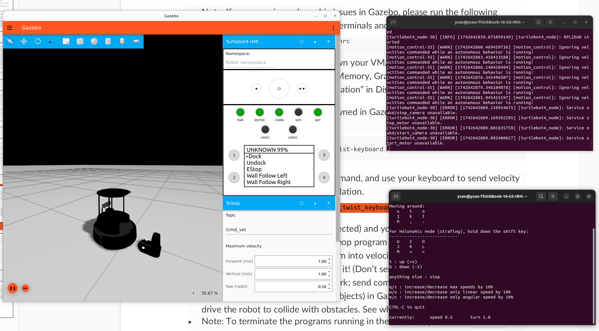
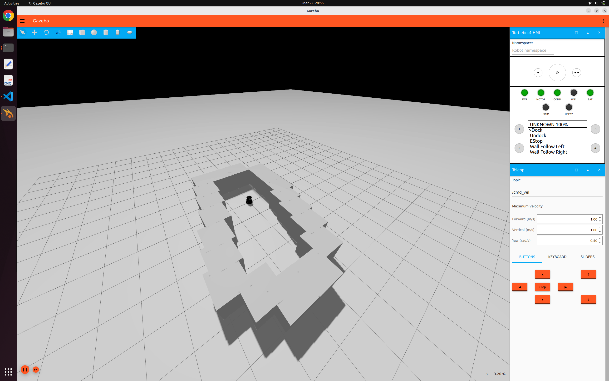
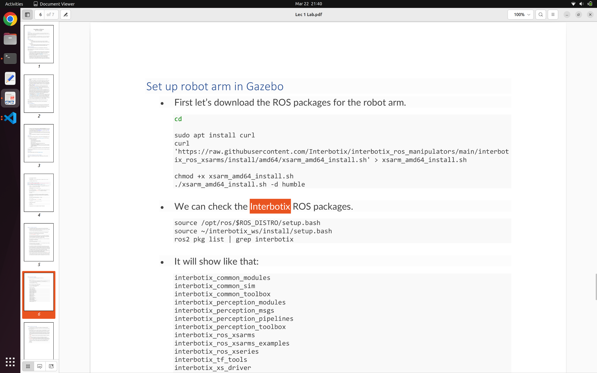
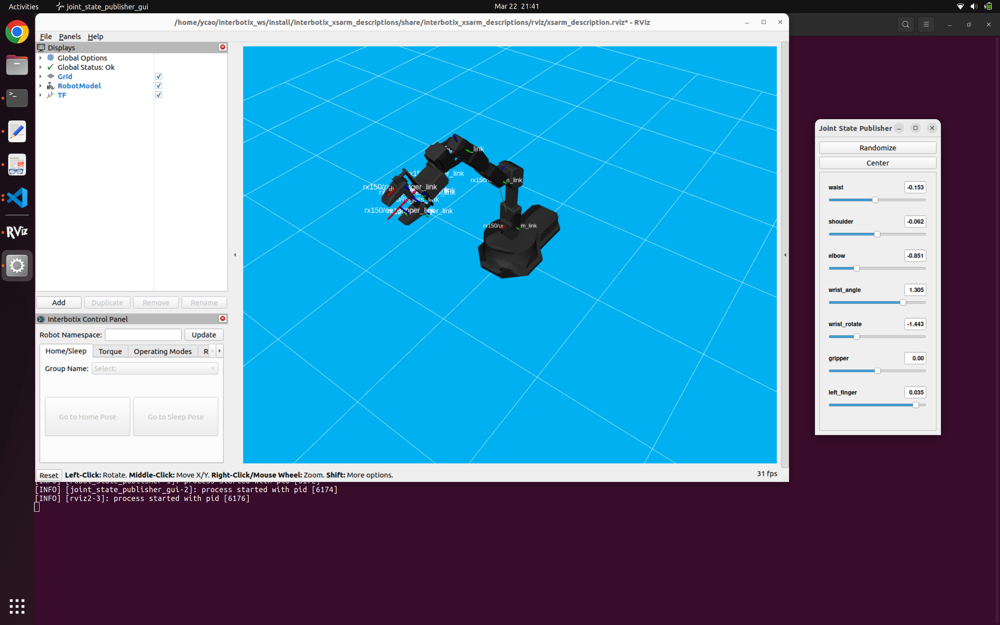

SUBMISSION 1
===
# 1 BRING UP A TURTLEBOT
First of all, the installation of ubuntu 22.04 / gazebo/ ros has been completed. Unlike what was presented in the Instruction, I have another disk to install ubuntu besides my windows. 

By running the turtlebot4 and teleop, the results are shown as following. It should be noted that the simulation must be started within the specified time or `diffdrive_controller` will fail to load.

The turtlebot has different modes that can be selected from the `Turtlebot HMI` above the window.  As we can see from the sematics, the modes are corresponding to `dock`, `undock`, `emergency stop`, `follow the left wall`, `follow the right wall`.

# 2 INSTALLATION THE INTERBOTIX ARM

The output as following, that means I have installed the interbotix correctly.

After running the rviz interface for the interbotix arm, I see the window below. The parameter use_joint_pub_gui allows we can control through the joint state publisher.

# 3 ROS PACKAGE AND COLCON 
Ros package can use `ros2 pkg create` to create a package, and in `ws`, we can use colcon build to compile the package. 