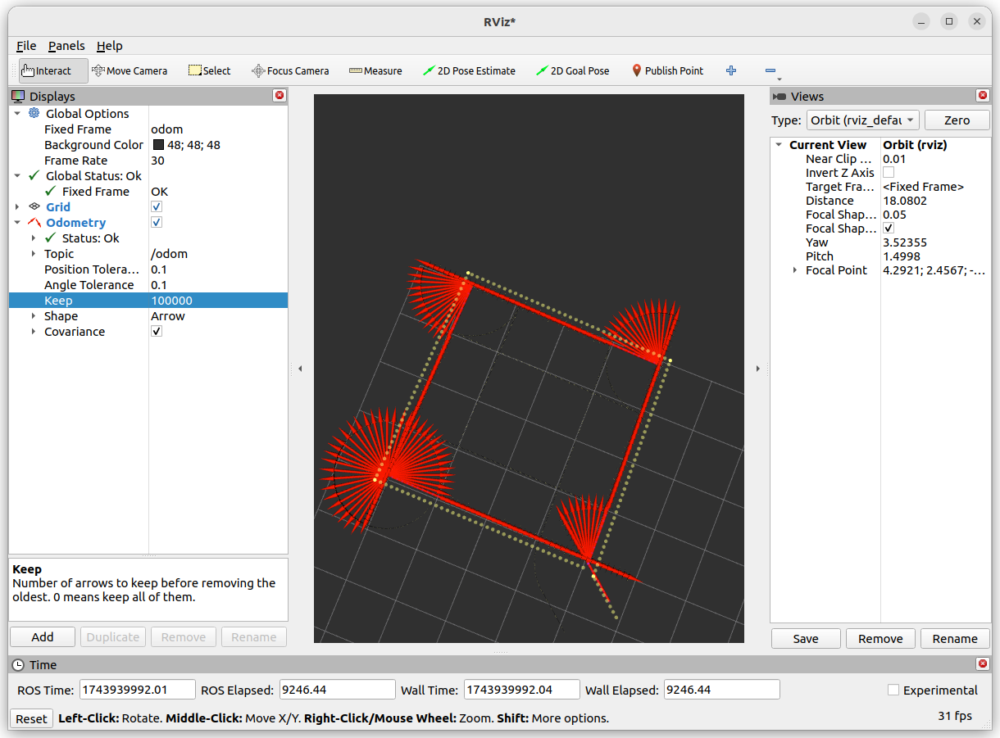

HOMEWORK3
===
AUTH : YCAO
因为是闭环控制，因此不存在`速度*时间=路程`，直接按照是否到达目标地作为控制目标。
首先先用C++重写了一下代码。

# 函数介绍
## Controller类
```cpp
class Controller {
    public:
        Controller(double P = 0.0, double D = 0.0, double set_point = 0.0) : Kp_(P), Kd_(D), set_point_(set_point), previous_error_(0.0) {}
    
        double update(double current_value) {
            double error = set_point_ - current_value;
            double derivative = error - previous_error_;
            previous_error_ = error;
    
            double P_term = Kp_ * error;
            double D_term = Kd_ * derivative;
    
            return P_term + D_term;
        }
    
        void setPoint(double set_point) {
            set_point_ = set_point;
            previous_error_ = 0.0;
        }
    
        void setPD(double P, double D) {
            Kp_ = P;
            Kd_ = D;
        }
    
    private:
        double Kp_;
        double Kd_;
        double set_point_;
        double previous_error_;
};
```
这是一个PD控制器。其中update用来计算最终的control输出，setPD用来设置参数，setPoint用来设置目标。在`Turtlebot`类中，包含一个实例化的控制器。每当需要控制某个值到某个值时，用`setPoint`设置目标值，并将当前状态输入即可。
## 转向函数
```cpp
void turn_to_angle(double target_angle, double tolerance = 0.01) {
        pid_theta_.setPoint(target_angle);

        double error = normalize_angle(target_angle - pose_.theta);
        while (fabs(error) > tolerance) {
            double control_output = pid_theta_.update(pose_.theta);
            vel_.linear.x = 0.0;
            vel_.angular.z = control_output;
    
            vel_pub_->publish(vel_);
            rclcpp::sleep_for(100ms);
    
            error = target_angle - pose_.theta;
        }
        stop();
    }
```
首先设置控制器的目标值。当前状态由`/odom`话题提供。然后用归一化函数（自行编写的）控制角度处于$-\pi$和$\pi$之间，然后当误差大于容许值时，进行pid运算（即`pid_theta_.update()`）。然后给出速度并发布。
## 直行函数
```cpp
void drive_straight(double target_distance, double tolerance = 0.01) {
        double initial_x = pose_.x;
        double initial_y = pose_.y;
        double distance_travelled = 0.0;

        pid_theta_.setPoint(target_distance);

        while ((target_distance - distance_travelled) > tolerance) {
            distance_travelled = sqrt(pow(pose_.x - initial_x, 2) + pow(pose_.y - initial_y, 2));
            double control_output = pid_theta_.update(distance_travelled);
            vel_.linear.x = control_output;
            vel_.angular.z = 0.0;

            vel_pub_->publish(vel_);
            rclcpp::sleep_for(100ms);
        }
        stop(); 
    }
```
与转向函数的工作方法类似。当前状态由`/odom`话题提供。给定目标距离后，进行pid运算后输出速度。
## 移动到点函数
```cpp
void move_to_point(double x, double y, double tolerance = 0.1) {
        double target_angle = atan2(y - pose_.y, x - pose_.x); 
        turn_to_angle(target_angle);

        double target_distance = sqrt(pow(x - pose_.x, 2) + pow(y - pose_.y, 2));
        drive_straight(target_distance, tolerance);
    }
```
即采用先转角，再向前移动的思路。
# 结果可视化
结果通过RVIZ可视化odom话题（fixed frame=odom）
