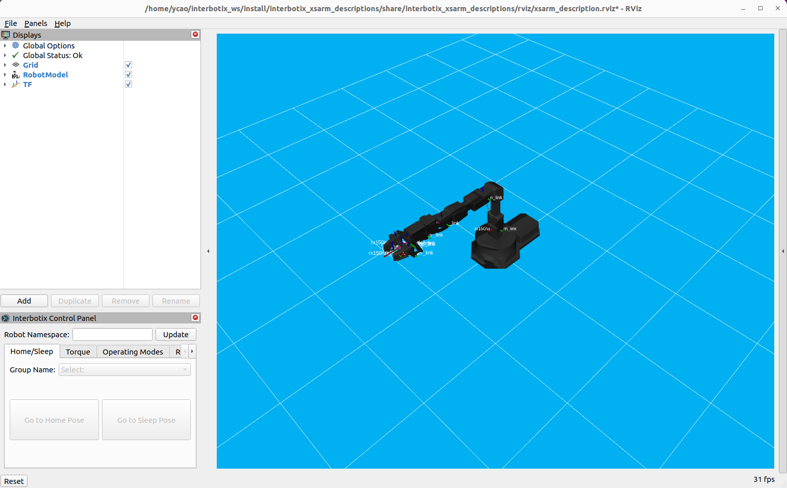
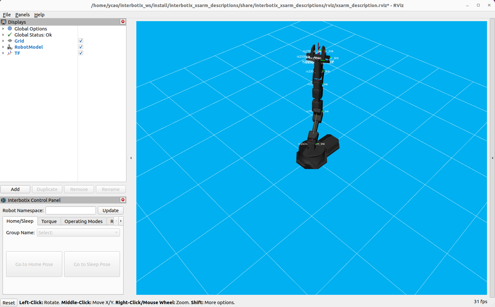

HOMEWORK 6
AUTH YCAO
===
同样的，仍然用`cpp`重写了代码
# 最终效果
## 初始形态

## 最终形态

# DH表示法
```cpp
#include "forward_kinematics/common.hpp"

std::array<double, 3> forward_kinematics(const std::array<double, 3>& joints)
{
    double link1z = 0.065;
    double link2z = 0.039;
    double link3x = 0.050;
    double link3z = 0.150;
    double link4x = 0.150;

    double joint1 = joints[0];
    double joint2 = joints[1];
    double joint3 = joints[2];

    double x = (link3x * cos(joint2) + link4x * cos(joint2 + joint3)) * cos(joint1);
    double y = (link3x * cos(joint2) + link4x * cos(joint2 + joint3)) * sin(joint1);
    double z = link1z + link2z + link3x * sin(joint2) + link4x * sin(joint2 + joint3);

    return {x, y, z};
}
```
# PoE表示法
```cpp
#include "forward_kinematics/common.hpp"

// Helper function to compute skew-symmetric matrix
Eigen::Matrix3d skew(const Eigen::Vector3d& v)
{
    Eigen::Matrix3d m;
    m << 0, -v.z(), v.y(),
         v.z(), 0, -v.x(),
        -v.y(), v.x(), 0;
    return m;
}

// Helper function to compute matrix exponential
Eigen::Matrix4d expm(const Eigen::Matrix4d& se3mat)
{
    Eigen::Matrix3d w_hat = se3mat.block<3,3>(0,0);
    Eigen::Vector3d v = se3mat.block<3,1>(0,3);
    double theta = w_hat.norm();

    Eigen::Matrix3d w_hat_unit = w_hat / theta;
    Eigen::Matrix3d R = Eigen::Matrix3d::Identity() + sin(theta)*w_hat_unit + (1-cos(theta))*(w_hat_unit*w_hat_unit);
    Eigen::Matrix3d V = Eigen::Matrix3d::Identity() + (1-cos(theta))*w_hat_unit + (theta - sin(theta))*(w_hat_unit*w_hat_unit);

    Eigen::Matrix4d expm;
    expm.setIdentity();
    expm.block<3,3>(0,0) = R;
    expm.block<3,1>(0,3) = V * v;
    return expm;
}

std::array<double, 3> forward_kinematics(const std::array<double, 3>& joint_angles)
{
    using namespace Eigen;

    double joint1 = joint_angles[0];
    double joint2 = joint_angles[1];
    double joint3 = joint_angles[2];

    // Define link lengths
    double link1z = 0.065;
    double link2z = 0.039;
    double link3x = 0.050;
    double link3z = 0.150;
    double link4x = 0.150;

    // Define the screw axes S1, S2, S3 (in space frame)
    Vector3d w1(0, 0, 1);   // rotate around z-axis
    Vector3d w2(0, 0, 1);
    Vector3d w3(0, 0, 1);

    Vector3d q1(0, 0, link1z + link2z);        // position of joint 1
    Vector3d q2 = q1;                          // position of joint 2 (same)
    Vector3d q3(q1(0) + link3x, q1(1), q1(2) + link3z); // joint 3 position (after link3)

    Vector3d v1 = -w1.cross(q1);
    Vector3d v2 = -w2.cross(q2);
    Vector3d v3 = -w3.cross(q3);

    // Screw axes in se(3)
    Matrix4d S1 = Matrix4d::Zero();
    S1.block<3,3>(0,0) = skew(w1);
    S1.block<3,1>(0,3) = v1;

    Matrix4d S2 = Matrix4d::Zero();
    S2.block<3,3>(0,0) = skew(w2);
    S2.block<3,1>(0,3) = v2;

    Matrix4d S3 = Matrix4d::Zero();
    S3.block<3,3>(0,0) = skew(w3);
    S3.block<3,1>(0,3) = v3;

    // Home configuration matrix M
    Matrix4d M = Matrix4d::Identity();
    M(0,3) = link3x + link4x;
    M(2,3) = link1z + link2z + link3z;

    // Compute transformation
    Matrix4d T = expm(S1 * joint1) * expm(S2 * joint2) * expm(S3 * joint3) * M;

    // Extract x, y, z
    double x = T(0,3);
    double y = T(1,3);
    double z = T(2,3);

    return {x, y, z};
}
```